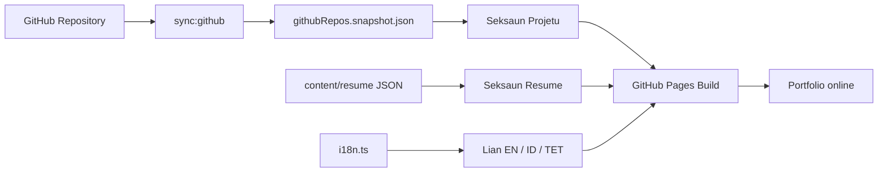
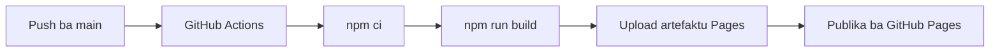

<div align="center">

# Hercio Portfolio

**Portfolio developer pessoal ne'ebe lalais, elegante, suporta lian tolu, no publika iha GitHub Pages.**


</div>

---

## Kona-ba Projetu

**Hercio Portfolio** mak website portfolio pessoal ba **Hercio Moreira Gusmao**. Projetu ida ne'e harii atu hatudu identidade profesional, projetu GitHub, esperiensia, edukasaun, teknolojia ne'ebe uza, no kontaktu iha fatin ida ne'ebe fasil ba empregador, kliente, no kolaborador.

- Uza **React** no **TypeScript** ba interface ne'ebe estruturadu no fasil atu hadia.
- Uza **Vite** atu halo build lalais no bundle kiik.
- Uza **GitHub API sync** atu repo publik foun bele tama ba portfolio.
- Uza **JSON content files** atu resume bele hadia la presiza muda komponente UI.
- Uza **GitHub Actions** no **GitHub Pages** atu publika automatiku ba internet.

Website ne'ebe online:

**https://herciomoreira3.github.io/**

## Teknolojia ne'ebe Uza

| Kategoria | Teknolojia | Funsaun |
| --- | --- | --- |
| Estrutura Interface | React | Komponente UI no portfolio pajina ida |
| Linguajen | TypeScript | Tipu dadus ne'ebe klaru ba dadus, props, no logika |
| Ferramenta Build | Vite | Server dezenvolvimentu no build produsaun lalais |
| Estilu | CSS Tokens | Sistema design, espasu, kleur, shadow, no UI responsivu |
| Ikon | Lucide React | Ikon ba nav, butaun, projetu, resume, no kontaktu |
| Conteudu | JSON | Resume, edukasaun, esperiensia, no data struktura |
| GitHub Sync | GitHub REST API | Foti repository publik atu hatudu iha Projetu |
| Publikasaun | GitHub Pages | Hosting gratis ba portfolio |
| CI/CD | GitHub Actions | Build no publikasaun automatiku bainhira push ba `main` |
| Admin Conteudu | Decap CMS skeleton | Base ba edisaun sem kodigu iha futuru |

## Funsaun Prinsipal

### Uma

- Seksaun hero ho naran, sinal verifikadu, status, no role ne'ebe muda-muda.
- Butaun asaun ba Projetu, GitHub, no WhatsApp.
- Avatar inicial **HM** ho visual loading ring.
- Otimizasaun mobile atu animasaun labele halo HP fraku sente todan.

### Projetu

- Hatudu curated project husi portfolio lama.
- Hatudu repository publik foun husi GitHub snapshot.
- Merge repository SmartPond ho case study SmartPond atu labele duplika.
- Hatudu repo portfolio rasik hanesan project: **Hercio Portfolio - GitHub Pages**.
- Kada project iha detail modal ho problema, fitur, implementasaun tekniku, benefisiu, stack, no link.

### Resume

- Hatudu esperiensia, edukasaun, highlight, no lingua.
- Conteudu resume mai husi file iha `content/resume/`.
- Suporta tradusaun ba **Tetun**, **Bahasa Indonesia**, no **Ingles**.

### Kaixa Ferramenta

- Link ba live demo **SIPOLAI**.
- Link download APK **Testora Android App** ba 32-bit no 64-bit.
- Repository Pulse atu hatudu total repo publik ne'ebe sync ona.

### Dezempenhu Mobile

- Mode mobile hamate blur todan, background grid, hover transform, reveal animation, no orbit animation.
- Uza `content-visibility: auto` atu navegador labele renderiza karta hotu iha tempu ida.
- Typewriter iha mobile muda ba rotasaun role ne'ebe leve liu.
- Estado scroll navbar atualiza deit bainhira seksaun muda.

## Fluxu Conteudu



## Estrutura Projetu

```text
Portfolio/
|-- .github/
|   `-- workflows/
|       `-- deploy.yml            # Build no publika ba GitHub Pages
|-- content/
|   `-- resume/                   # Esperiensia, edukasaun, sertifikasaun
|-- public/
|   |-- .nojekyll                 # GitHub Pages serve asset diretamente
|   `-- admin/                    # Decap CMS skeleton
|-- scripts/
|   `-- sync-github-repos.mjs     # Sincroniza repository publik husi GitHub API
|-- src/
|   |-- components/               # Hero, Projetu, Resume, Kaixa Ferramenta, Kontaktu
|   |-- data/                     # Perfil, skills, projetu, GitHub snapshot
|   |-- lib/                      # Logika merge GitHub no loader conteudu
|   |-- styles/                   # Token no CSS global
|   |-- App.tsx                   # Layout principal
|   `-- main.tsx                  # Pontu tama React
|-- README.md
|-- package.json
|-- tsconfig.json
`-- vite.config.ts
```

## Fonte Dadus

| Fonte | Deskrisaun |
| --- | --- |
| `src/data/profile.ts` | Naran, role, email, telefone, links, no stats |
| `src/data/projects.ts` | Curated projects ho case study detail |
| `src/data/githubRepos.snapshot.json` | Repository publik ne'ebe sincroniza husi GitHub |
| `src/data/skills.ts` | Lista teknolojia ne'ebe hatudu iha seksaun Tech Stack |
| `content/resume/*.json` | Esperiensia, edukasaun, no item resume seluk |
| `src/i18n.ts` | Tradusaun Ingles, Indonesia, no Tetun |

## Oinsa Halai iha Lokal

1. Instala dependensia:

```bash
npm install
```

2. Halai server dezenvolvimentu:

```bash
npm run dev
```

3. Loke iha navegador:

```text
http://127.0.0.1:5173/
```

## Komandu Util

```bash
npm run sync:github
npm run typecheck
npm run build
npm run dev
```

## Publikasaun

Publikasaun halo automaticamente bainhira push ba branch `main`.



URL publik:

```text
https://herciomoreira3.github.io/
```

## Otimizasaun

- Sistema token CSS atu UI konsistente no leve.
- Breakpoint mobile hamate efek visual ne'ebe todan.
- `content-visibility` ajuda navegador atu renderiza seksaun bainhira presiza deit.
- Build Vite fo bundle kiik no load lalais.
- GitHub snapshot evita fetch API direta iha navegador, nune'e pajina load lalais liu.

## Planu ba Oin

- Aumenta screenshot project ba kada case study.
- Aumenta blog ka notes tekniku iha portfolio.
- Hadia Decap CMS flow atu resume bele edit liu husi admin UI.
- Aumenta workflow ne'ebe halai tuir tempu atu sync repo GitHub automaticamente.
- Aumenta dadus SEO no imajen Open Graph.

## Licensa

Projetu ida ne'e mak portfolio pessoal. Uza, adapta, ka aprende husi estrutura ho respeitu ba identidade, naran, no conteudu pessoal ne'ebe iha repo ne'e.

---

<div align="center">

**Hercio Portfolio - Portfolio developer ne'ebe leve, elegante, no prontu ba kolaborasaun.**

</div>
